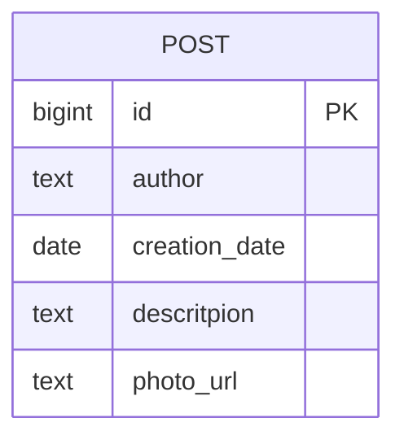

# module2_catsgram

## ER-диаграмма

```mermaid
erDiagram
    POST {
        bigint id PK
        text author
        date creation_date
        text descritpion
        text photo_url
    }
```

# Запуск apache Pulsar

См. https://pulsar.apache.org/docs/3.3.x/getting-started-docker-compose/